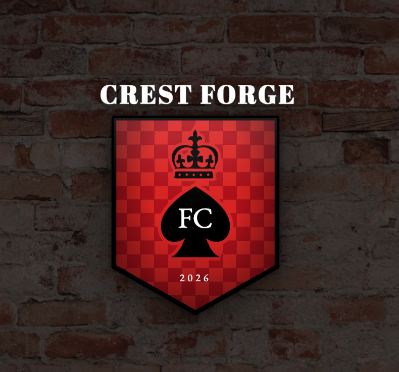
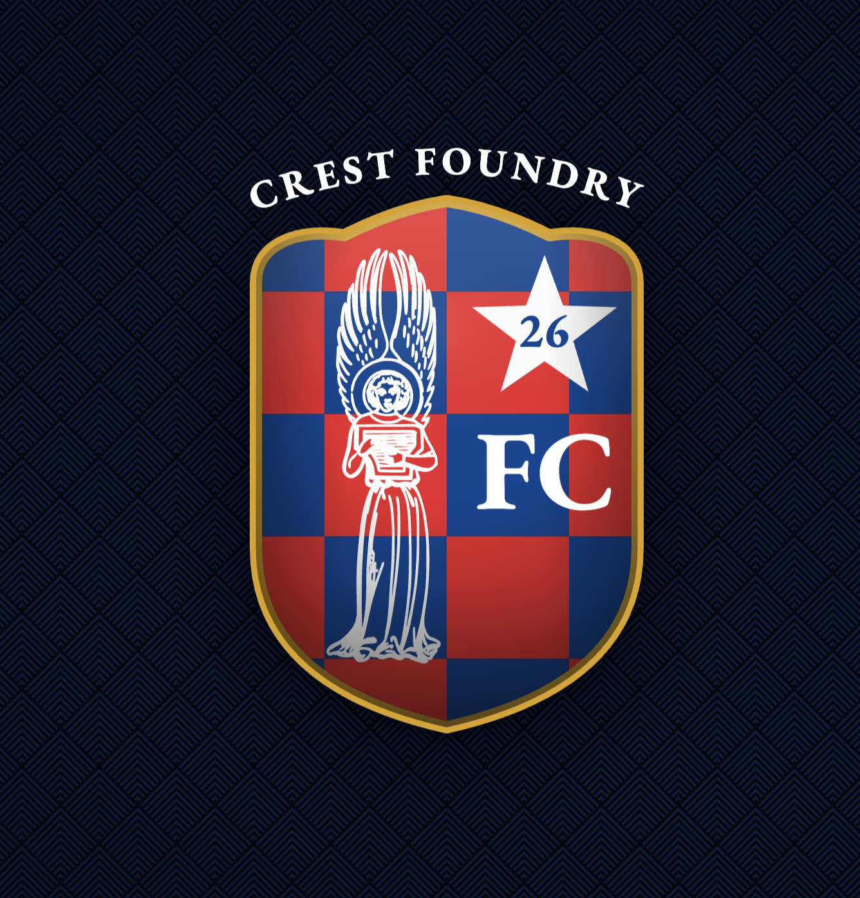
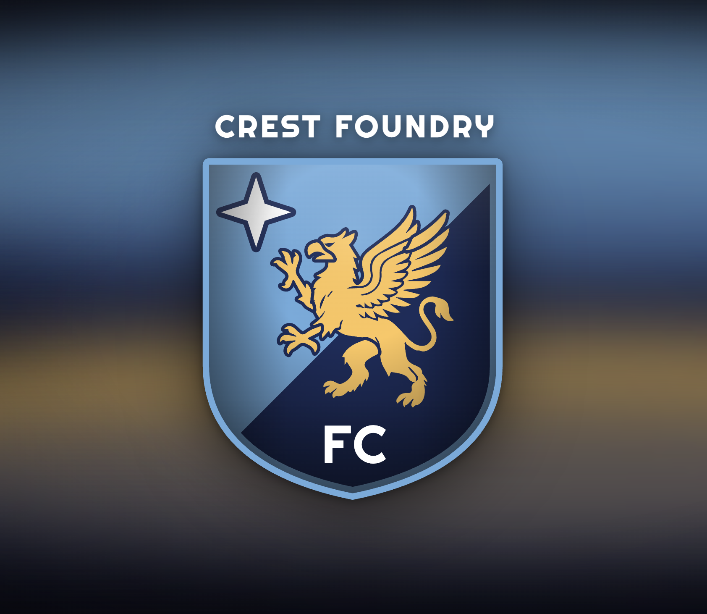
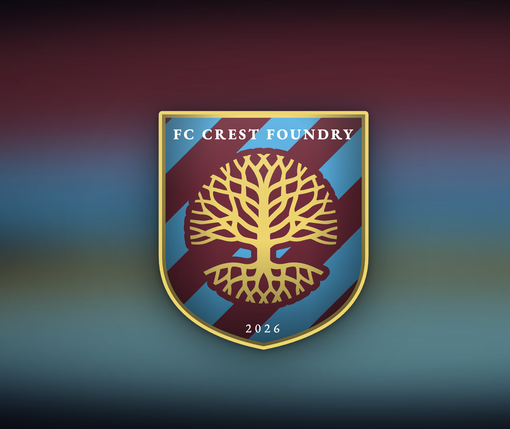

# Crest Foundry

A browser-based club crest creator for designing custom badges for any club — football/soccer, scholastic, recreational, intramural, social, role-playing, and more. Combine shield shapes, heraldic symbols, background patterns, text, and borders — then snapshot your work for later.

---

## Screenshots

<table>
  <tr>
    <td align="center"><br/><sub>Flamingo · diagonal stripes</sub></td>
    <td align="center"><br/><sub>Unicorn · free crown above badge</sub></td>
    <td align="center"><br/><sub>Star burst · sash · fabric bg</sub></td>
    <td align="center"><br/><sub>Spade · crown · checkered · brick bg</sub></td>
  </tr>
  <tr>
    <td align="center"><br/><sub>Diamond · free star above</sub></td>
    <td align="center"><br/><sub>AAC · pennant · fabric bg</sub></td>
    <td align="center"><br/><sub>Spartan · sun burst · stadium bg</sub></td>
    <td align="center"><br/><sub>Swallow · circular · arc text · grass bg</sub></td>
  </tr>
  <tr>
    <td align="center"><br/><sub>Angel emblem · checkered · gold border · arc text</sub></td>
    <td align="center"><br/><sub>Griffin · diagonal split · star</sub></td>
    <td align="center"><br/><sub>Tree of life · diagonal stripes · gold border</sub></td>
  </tr>
</table>

---

## Features

- **Shield shapes** — multiple traditional badge silhouettes
- **Background patterns** — solid, gradient (linear & radial), halved, quartered, diagonal, chevron, sash, and striped variants
- **Heraldic symbols** — 400+ SVG icons across groups: Crowns, Beasts, Birds, Maritime, Weapons, Buildings, Heraldic, Celestial, Shapes, Flora, Industrial, Mythical, Fantasy, Emblems, Nature, Insects, and Sport
- **Text layers** — straight or arc text with font, size, weight, letter-spacing, and color controls; drag to reposition, scroll to resize
- **Border** — adjustable color and thickness
- **Club color palette** — load real club colors or build a custom palette of up to 6 colors
- **Scene backgrounds** — Bokeh, Aurora, Waves, Criss-Cross, and photo backgrounds (grass, stadium, fabric, brick, pitch) with overlay color and opacity control
- **Drag & drop** — drag symbols and text freely within the badge canvas
- **Arrow key nudging** — 1px steps, Shift+Arrow for 10px
- **Scroll to resize** — scroll over any symbol or text element to resize it in place
- **Randomizer** — Space bar or ⚄ button generates a random badge from real club color data
- **Snapshots** — save named design snapshots (config + thumbnail) to localStorage; load or delete from the in-app library; Cmd+S shortcut
- **Export** — download your crest as a transparent **PNG** or a self-contained **SVG** (see below)

---

## Export

Two one-click downloads from the badge toolbar; both have a fully transparent background outside the shield.

- **⬇ PNG** — high-resolution raster (~1600×1920). Fonts are embedded during rasterization, so text is always faithful.
- **⬇ SVG** — a self-contained vector file with **all text converted to outlines** ("Create Outlines"). No fonts are required to open or print it anywhere — glyphs are real `<path>` geometry, so it drops cleanly into Illustrator, Inkscape, or a print RIP.

Both files are named `crest-foundry-<club-name>.<ext>`.

**Auto-fit frame** — if a symbol or text element is placed outside the 200×240 badge bounds, the export **expands its frame** (viewBox + canvas) to include everything with a small margin, so nothing is clipped (PNG) or left off the artboard (SVG). Designs that stay within bounds export at the usual 200×240.

**How it works & gotchas learned**

- **Fonts in exports:** a standalone SVG (rasterized via `` for PNG, or opened as a file) does **not** inherit the page's web fonts. PNG embeds each used font as a subsetted base64 `@font-face`; SVG outlines the glyphs instead (via [opentype.js](https://github.com/opentypejs/opentype.js), lazy-loaded only on export).
- **Glyph outlining** reads **WOFF v1** font files from [Fontsource](https://fontsource.org/) (jsDelivr) — real per-weight files, so **bold** stays bold. (Google serves WOFF2, which opentype.js can't read; the `wawoff2` decompressor **hangs in-browser under Vite**, so we avoid it entirely.) Glyph *placement* — including text on an arc — comes from the browser's own `getStartPositionOfChar` / `getRotationOfChar`.
- **`paint-order` & Illustrator:** symbols paint their stroke *behind* the fill (`paint-order="stroke fill"`) so only a thin outer outline shows. Illustrator ignores `paint-order` and paints the stroke centered on top, reading ~2× thicker. The SVG export **flattens `paint-order`** into explicit draw order (stroke-only path behind, fill-only path on top) so strokes match the editor in every viewer.
- **Illustrator clip warning:** opening the SVG may show *"Clipping will be lost on roundtrip to Tiny"* — this is a **benign** SVG-Tiny-profile caution about the shield `<clipPath>`. The art imports fully, with clipping applied as a normal Illustrator clip mask.

> _Text stroke and a print-grade vector PDF (bleed/margins) are possible future additions._

---

## Stack

- **Vue 3** + **Vite** (no TypeScript)
- **Plain scoped CSS** — no utility framework
- **opentype.js** — SVG-export text→outline (lazy-loaded only on export)
- No backend (Phase 2: Supabase for save/share/gallery)

---

## Project Structure

```
src/
  components/
    BadgeComposer.vue       # SVG renderer + drag handling
    IconPicker.vue          # Symbol gallery
    TextEditor.vue          # Text element list + controls
    SnapshotPanel.vue       # Save/load design snapshots
  composables/
    useBadgeConfig.js       # All reactive badge state + mutations
  data/
    clubs.js                # Real club color palettes
    icons.js                # 260+ heraldic SVG symbols (many imported from game-icons.net)
    shapes.js               # Shield shape path definitions
    symbols-to-be-processed/  # Staging directory for incoming SVGs
  utils/
    snapshots.js            # localStorage snapshot save/load/capture
    arcPath.js              # SVG arc path generator for text
    exportBadge.js          # PNG + SVG export (planned)
  App.vue
  style.css
scripts/
  import-game-icons.mjs     # Authoring tool: import icons from game-icons.net into icons.js
designs/                    # Saved badge screenshots
```

---

## Getting Started

```bash
npm install
npm run dev
```

---

## Keyboard Shortcuts

| Key | Action |
|---|---|
| Space | Randomize badge |
| Arrow keys | Nudge selected symbol or text (1px) |
| Shift + Arrow | Nudge 10px |
| Cmd/Ctrl + C | Copy selected symbol or text |
| Cmd/Ctrl + V | Paste copied element |
| Cmd/Ctrl + S | Save snapshot |
| Escape | Deselect |
| Delete / Backspace | Remove selected element |

---

## Credits

Many heraldic symbols are imported from [game-icons.net](https://game-icons.net), licensed under [CC BY 3.0](https://creativecommons.org/licenses/by/3.0/). Authors: carl-olsen, caro-asercion, delapouite, lorc, sbed, skoll, and sparker. These are also credited in-app via the ⓘ About dialog. Icons are pulled in with `scripts/import-game-icons.mjs` (a build-time authoring tool, not a runtime dependency).
