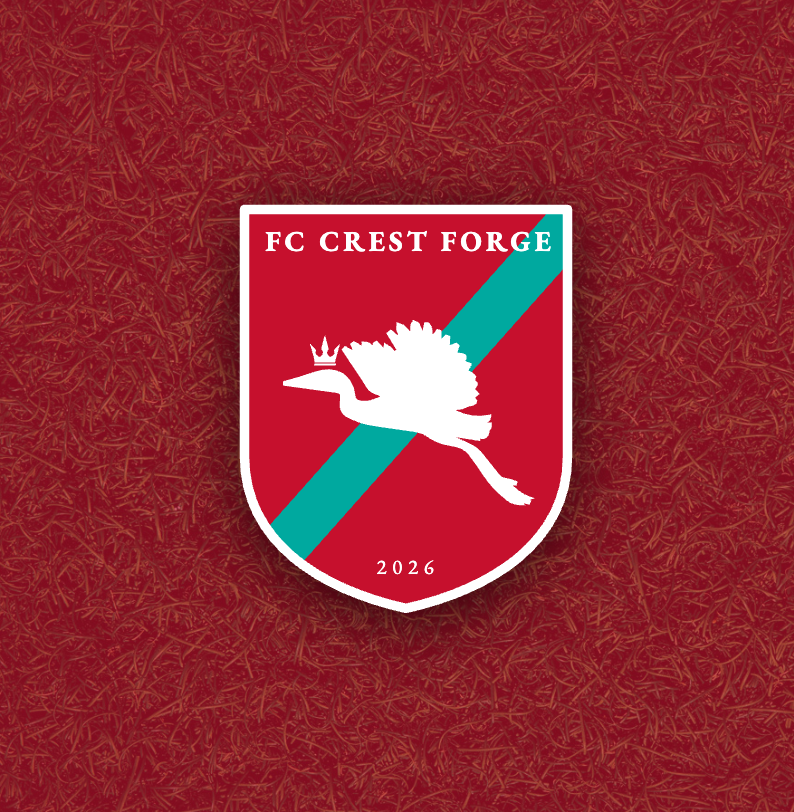
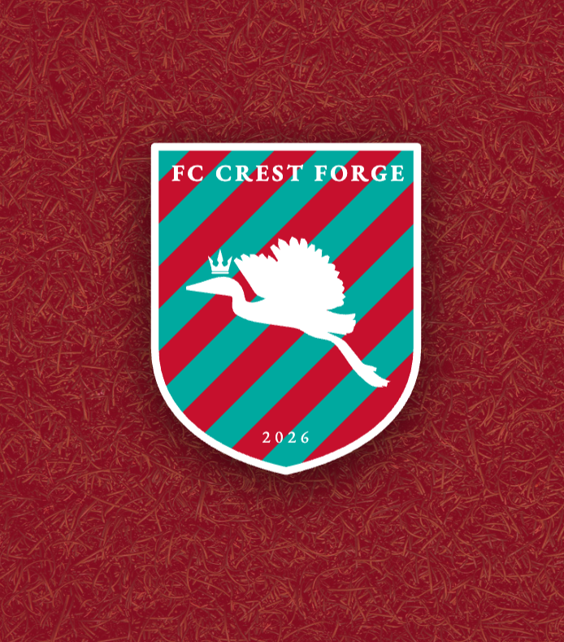
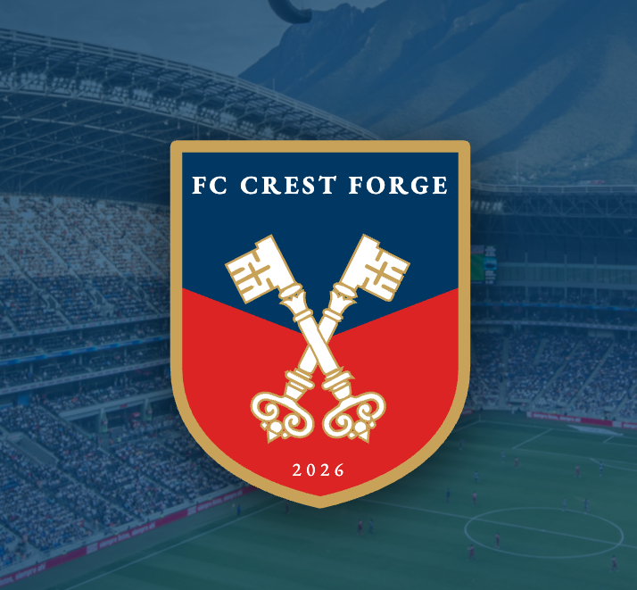
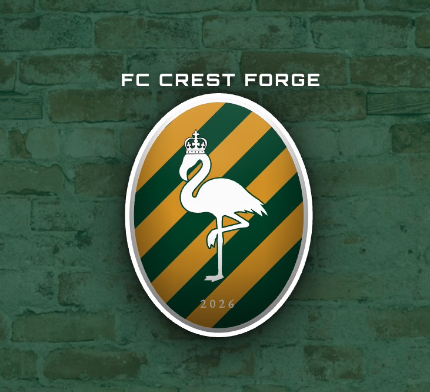
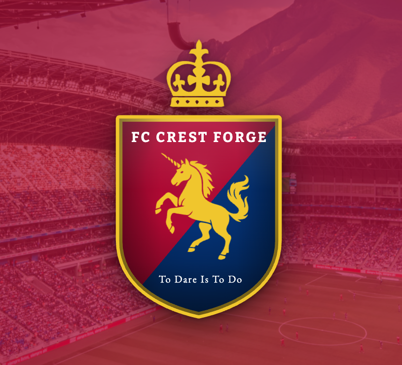

# Crest Forge

A browser-based football badge creator for designing custom club crests. Combine shield shapes, heraldic symbols, background patterns, text, and borders — then snapshot your work for later.

---

## Screenshots

<table>
  <tr>
    <td align="center"><br/><sub>Loon · diagonal sash</sub></td>
    <td align="center"><br/><sub>Loon · diagonal stripes</sub></td>
    <td align="center"><br/><sub>Crossed keys · chevron</sub></td>
  </tr>
  <tr>
    <td align="center"><br/><sub>Flamingo · diagonal stripes</sub></td>
    <td align="center"><br/><sub>Unicorn · free crown above badge</sub></td>
    <td></td>
  </tr>
</table>

---

## Features

- **Shield shapes** — multiple traditional badge silhouettes
- **Background patterns** — solid, halved, quartered, diagonal, chevron, sash, and striped variants
- **Heraldic symbols** — 80+ SVG icons across groups: Crowns, Beasts, Birds, Maritime, Weapons, Buildings, Heraldic, Celestial, Shapes, and Flora
- **Text layers** — straight or arc text with font, size, weight, letter-spacing, and color controls; drag to reposition, scroll to resize
- **Border** — adjustable color and thickness
- **Club color palette** — load real club colors or build a custom palette of up to 6 colors
- **Scene backgrounds** — Bokeh, Aurora, Waves, Criss-Cross, and photo backgrounds (grass, stadium, fabric, brick, pitch) with overlay color and opacity control
- **Drag & drop** — drag symbols and text freely within the badge canvas
- **Arrow key nudging** — 1px steps, Shift+Arrow for 10px
- **Scroll to resize** — scroll over any symbol or text element to resize it in place
- **Randomizer** — Space bar or ⚄ button generates a random badge from real club color data
- **Snapshots** — save named design snapshots (config + thumbnail) to localStorage; load or delete from the in-app library; Cmd+S shortcut

---

## Stack

- **Vue 3** + **Vite** (no TypeScript)
- **Plain scoped CSS** — no utility framework
- No backend (Phase 2: Supabase for save/share/gallery)

---

## Project Structure

```
src/
  components/
    BadgeComposer.vue       # SVG renderer + drag handling
    IconPicker.vue          # Symbol gallery
    TextEditor.vue          # Text element list + controls
    SnapshotPanel.vue       # Save/load design snapshots
  composables/
    useBadgeConfig.js       # All reactive badge state + mutations
  data/
    clubs.js                # Real club color palettes
    icons.js                # 80+ heraldic SVG symbols
    shapes.js               # Shield shape path definitions
    symbols-to-be-processed/  # Staging directory for incoming SVGs
  utils/
    snapshots.js            # localStorage snapshot save/load/capture
    arcPath.js              # SVG arc path generator for text
    exportBadge.js          # PNG + SVG export (planned)
  App.vue
  style.css
designs/                    # Saved badge screenshots
```

---

## Getting Started

```bash
npm install
npm run dev
```

---

## Keyboard Shortcuts

| Key | Action |
|---|---|
| Space | Randomize badge |
| Arrow keys | Nudge selected symbol or text (1px) |
| Shift + Arrow | Nudge 10px |
| Cmd/Ctrl + S | Save snapshot |
| Escape | Deselect |
| Delete / Backspace | Remove selected element |
